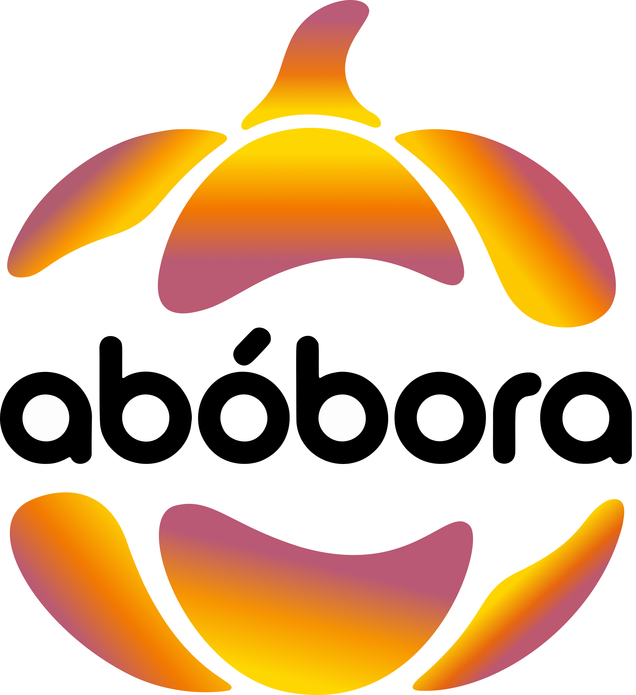
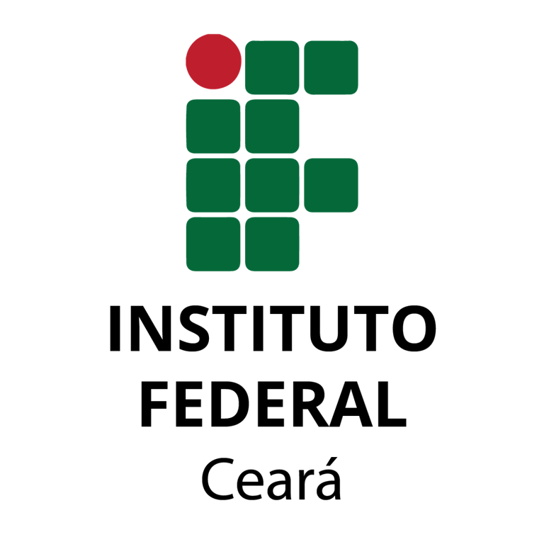

# 🎃 Matheus Willamy

**`Desenvolvedor FullStack`**

> Desenvolvedor com mentalidade de produto e paixão por construir soluções que resolvem problemas reais.

Olá! Sou Matheus Willamy, sou natural de Fortaleza, Ceará. Minha trajetória na tecnologia começou no curso Técnico em Informática pelo **IFCE** e hoje continuo na graduação em **Análise e Desenvolvimento de Sistemas**. Sou movido pela curiosidade e pela vontade de "fazer acontecer".
### 🚀 Minha Jornada Empreendedora

Acredito que a melhor forma de aprender é construindo. Por isso, fundei a **Abóbora Tech**, minha iniciativa para prestar serviços de desenvolvimento de software. Meu projeto de maior destaque foi a criação de um **sistema de gestão (SaaS)** completo.

### 🏆 Reconhecimentos

Fui finalista premiado (Top 5) no **Hackathon de Impacto Juventude Digital**, um evento intenso de 48 horas focado em criar soluções para a inclusão produtiva de jovens no mercado de trabalho.

 
    
    

---

### 🤖 Linguagens e Tecnologias

 
 

### 📊 Estatísticas

  
  

 
 

---

### 💼 Projetos em Destaque e Experiências

Aqui estão os principais projetos e desafios reais que desenvolvi ao longo da minha carreira, unindo engenharia de software, automação e experiência do usuário (UX).

 

<!-- PROJETO 1: ABÓBORA TECH (SaaS) -->
<table width="100%" style="border: 1px solid rgba(128,128,128,0.3); border-radius: 12px; border-collapse: separate; border-spacing: 0; margin-bottom: 25px;">
  <tr>
    <td width="35%" align="center" style="padding: 15px; border-right: 1px solid rgba(128,128,128,0.2);">
      
    </td>
    <td width="65%" valign="top" style="padding: 20px;">
      <h3 style="margin-top: 0; margin-bottom: 5px;">🏢 Sistema de Gestão e Automação com IA (SaaS)</h3>
      
<em>Abóbora Tech | Dez/2024 - Jan/2026</em>

      
Desenvolvimento Full-Stack de um sistema de gestão ponta a ponta. Construí a arquitetura Back-end em Node.js e interfaces focadas em UX/UI.

      
🚀 <strong>Impacto:</strong> Implementei agentes de Inteligência Artificial para extração de dados de faturas, alcançando <strong>precisão de mais de 95%</strong> e eliminando <strong>~20 horas semanais</strong> de trabalho manual repetitivo.

      

        
        
        
        
      

    </td>
  </tr>
</table>

<!-- PROJETO 2: PREFEITURA / CGM -->
<table width="100%" style="border: 1px solid rgba(128,128,128,0.3); border-radius: 12px; border-collapse: separate; border-spacing: 0; margin-bottom: 25px;">
  <tr>
    <td width="35%" align="center" style="padding: 15px; border-right: 1px solid rgba(128,128,128,0.2);">
      
    </td>
    <td width="65%" valign="top" style="padding: 20px;">
      <h3 style="margin-top: 0; margin-bottom: 5px;">📊 Automação de Relatórios e Dashboards</h3>
      
<em>Prefeitura de Fortaleza (CGM) | Dez/2022 - Nov/2023</em>

      
Estruturação visual (MVP) e criação de painéis interativos para acompanhamento de dados históricos, garantindo uma navegação intuitiva.

      
🚀 <strong>Impacto:</strong> Desenvolvi um motor de automação para o Controle Interno, gerando relatórios padronizados para mais de 15 órgãos públicos e <strong>otimizando o tempo da equipe em 70%</strong>.

      

        
        
        
      

    </td>
  </tr>
</table>

<!-- PROJETO 3: AQUAMETRICS IOT (IFCE) -->
<table width="100%" style="border: 1px solid rgba(128,128,128,0.3); border-radius: 12px; border-collapse: separate; border-spacing: 0; margin-bottom: 25px;">
  <tr>
    <td width="35%" align="center" style="padding: 15px; border-right: 1px solid rgba(128,128,128,0.2);">
      
    </td>
    <td width="65%" valign="top" style="padding: 20px;">
      <h3 style="margin-top: 0; margin-bottom: 5px;">🐟 AquaMetrics: Monitoramento IoT para Aquicultura</h3>
      
<em>Projeto de Pesquisa - IFCE | Dez/2020 - Jul/2022</em>

      
Plataforma Web/Desktop integrada a sensores de hardware para processar telemetria em tempo real da qualidade da água em viveiros de tilápia.

      
🚀 <strong>Impacto:</strong> Arquitetei um <i>middleware</i> em Python para ingestão de dados seriais, resolvendo falhas de latência. Criei a interface operacional para gestão de alertas (Online/Offline).

      

        
        
        
      

    </td>
  </tr>
</table>
 

### 📬 Vamos Conversar?

Fique à vontade para entrar em contato comigo para falar sobre tecnologia, negócios, ideias de produto ou vagas!

  
  
  

